## Today’s agenda

::::: columns
::: {.column width="70%"}
-   Dijkstra’s Planning Algorithm
-   A\* Planning Algorithm
-   Sampling Based Planners
    -   Rapidly-exploring Random Trees (RRT)
    -   Probabilistic Roadmaps (PRM)
:::

::: {.column width="30%"}
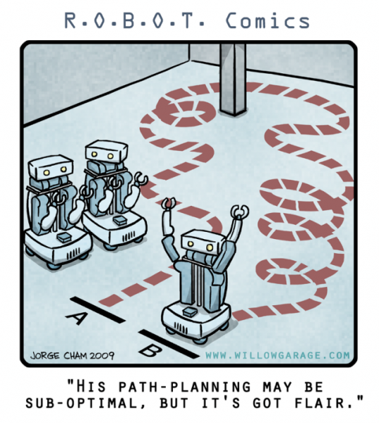
:::
:::::

## Planning

-   So far we have been trying to compute state-dependent **feedback controllers u(x)=** **Kx**

. . .

-   A plan is usually “open-loop,” in the sense that it is assumed that once computed you can execute it perfectly

-   This is not realistic because: wind, drag, external forces, friction, unknown factors make the system diverge from the planned trajectory.

. . .

-   Planning does not usually take external disturbances into account.\
    (External, independent feedback controllers have to make sure the robot is following the path closely)

## Why Bother Planning?

{fig-align="center"}

## Sense-Plan-Act Paradigm: Planning Is Necessary

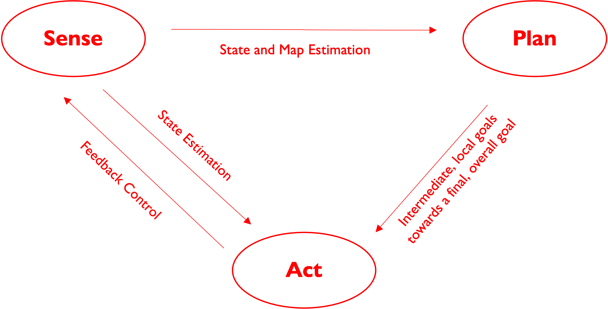{fig-align="center" width="700" height="400"}

## Sense-Plan-Act Paradigm: Planning Is Necessary

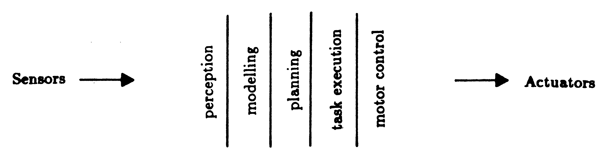{height="400" fig-align="center"}

## Subsumption Architecture: Planning Is Not Necessary

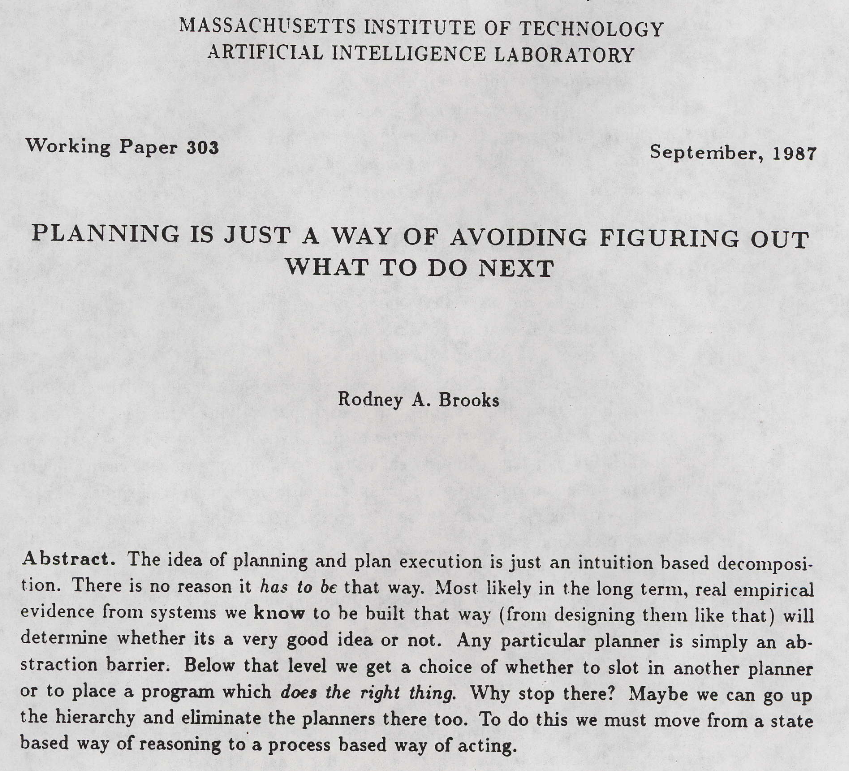{fig-align="center"}

## Subsumption Architecture: Planning Is Not Necessary

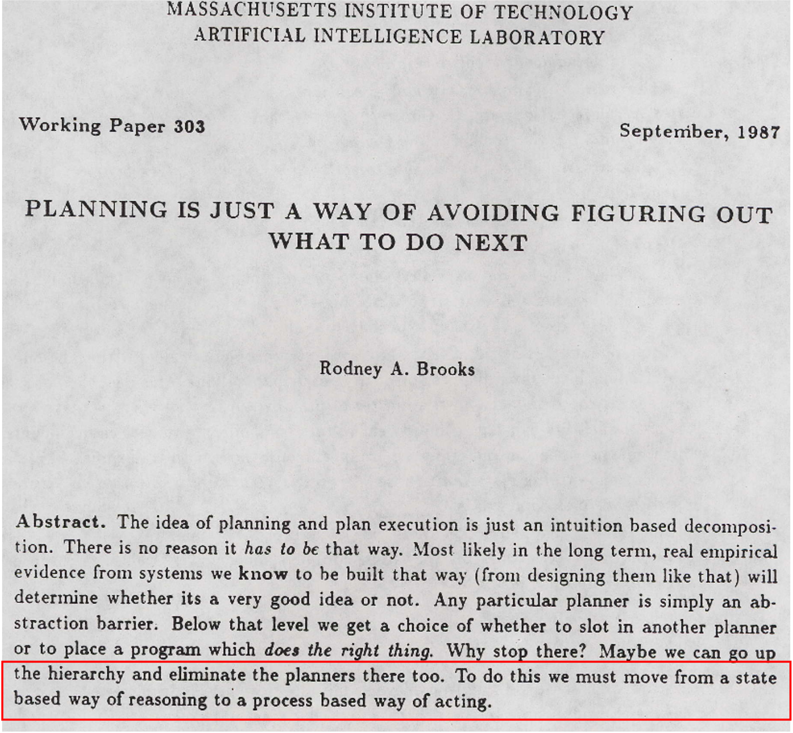{fig-align="center"}

::: {.red-annotation .absolute left="0" bottom="0"}
He means: why bother\
estimating state and planning?\
It’s too much work and could be\
error-prone. Why not only have\
a hierarchy of reactive\
behaviors/controllers?

One possibility:\
instead of u(state)=…\
use u(sensory observation)=…
:::

## Subsumption Architecture: Planning Is Not Necessary

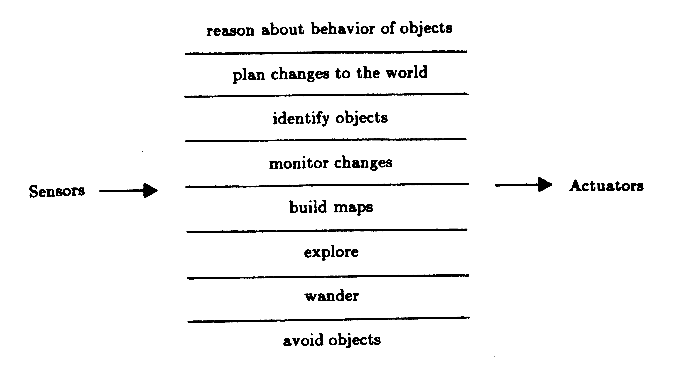{fig-align="center"}

## Subsumption Architecture: How It Works

-   Rodney Brooks (MIT, 1986): *"A Robust Layered Control System for a Mobile Robot"*
-   Decompose the robot by **behaviors** (avoid obstacles, wander, explore, ...), not by functional modules (perception → world model → planner → controller)
-   Each layer is a set of simple, reactive finite state machines that map sensor readings directly to actions
-   Higher layers **subsume** lower layers: they can suppress their inputs or inhibit their outputs, but lower layers keep running
-   Build incrementally: get "avoid obstacles" working, then add "wander" on top of it, etc.

. . .

-   No central world model or state estimate: [*"The world is its own best model"*]{.red}
-   Led to Genghis (six-legged walking robot, 1989) and, via iRobot, the Roomba

. . .

-   [Limitation: hard to scale to tasks that need long-horizon reasoning, e.g. finding the shortest path to a goal across a building. That is where planning comes in.]{.red}

## Planning as graph search

-   Graph nodes represent discrete states

-   Edges represent transitions/actions

-   Edges have weights

-   Potential queries:

    -   Shortest path from node a to node b, that does not hit obstacles
    -   Is b reachable from a?

. . .

-   Typical assumptions:
    -   Current state is known
    -   Map is known
    -   Map is mostly static

## Dynamic Programming

$$
D(v, v_{dest}) = \min_{u \in N(v)} [d(v, u) + D(u, v_{dest})] 
$$

$$
D(v_{dest}, v_{dest}) = 0
$$

::: {.red-annotation .absolute top="235" left="170" style="padding: 2px 12px;"}
Cost-to-go from $v$ to $v_{dest}$ 
:::

::: {.red-annotation .absolute top="225" left="660" width="300" style="padding: 2px 12px;"}
Instantaneous transition\
cost (non-negative)
:::

<svg class="annotation-layer">
<defs><marker id="dp-arrow" markerWidth="6" markerHeight="6" refX="6" refY="3" orient="auto"><path d="M0,0 L6,3 L0,6 z"/></marker></defs>
<line x1="250" y1="232" x2="338" y2="145" marker-end="url(#dp-arrow)"/>
<line x1="695" y1="222" x2="570" y2="151" marker-end="url(#dp-arrow)"/>
</svg>

## Dynamic Programming

$$
D(v, v_{dest}) = \min_{u \in N(v)} [d(v, u) + D(u, v_{dest})] 
$$

$$
D(v_{dest}, v_{dest}) = 0
$$

::: {.red-annotation .absolute top="240" left="150" width="280"}
Cost-to-go from $v$ to $v_{dest}$
:::

::: {.red-annotation .absolute top="128" left="800" width="220"}
Neighbors of $v$,\
i.e. available actions
:::

::: {.red-annotation .absolute top="225" left="660" width="300"}
Instantaneous transition\
cost (non-negative)
:::

::: {.red-annotation .absolute top="268" left="480"}
Base case
:::

<svg class="annotation-layer">
<defs><marker id="dp2-arrow" markerWidth="6" markerHeight="6" refX="6" refY="3" orient="auto"><path d="M0,0 L6,3 L0,6 z"/></marker></defs>
<line x1="250" y1="236" x2="338" y2="145" marker-end="url(#dp2-arrow)"/>
<line x1="795" y1="141" x2="515" y2="141" marker-end="url(#dp2-arrow)"/>
<line x1="695" y1="222" x2="570" y2="151" marker-end="url(#dp2-arrow)"/>
<line x1="530" y1="262" x2="530" y2="228" marker-end="url(#dp2-arrow)"/>
</svg>

 

 

::: {layout="[35, 65]"}
[Note: this should remind you\
of the LQR cost-to-go update]{.red-annotation}

$$
\begin{align}
J_{t+1}(\mathbf{x}) &= \min_{\mathbf{u}} [g(\mathbf{x}_t, \mathbf{u}_t) + J_t(A\mathbf{x} + B\mathbf{u})] \\
J_0(\mathbf{x}) &= \mathbf{x}^T Q\mathbf{x}
\end{align}
$$
:::

## Dynamic Programming

$$
D(v, v_{dest}) = \min_{u \in N(v)} [d(v, u) + D(u, v_{dest})] 
$$

$$
D(v_{dest}, v_{dest}) = 0
$$

::: {.small-font .absolute left="0" top="100"}
Worst-Case\
Complexity:\
$O(|V|^2)$

In 2D grid world\
$O(|V|)$
:::

::: {.red-annotation .absolute top="240" left="150" width="320"}
Cost-to-go from $v$ to $v_{dest}$
:::

::: {.red-annotation .absolute top="225" left="660" width="300"}
Instantaneous transition\
cost (non-negative)
:::

::: {.red-annotation .absolute top="268" left="480"}
Base case
:::

<svg class="annotation-layer">
<defs><marker id="dp3-arrow" markerWidth="6" markerHeight="6" refX="6" refY="3" orient="auto"><path d="M0,0 L6,3 L0,6 z"/></marker></defs>
<line x1="250" y1="236" x2="338" y2="145" marker-end="url(#dp3-arrow)"/>
<line x1="695" y1="222" x2="570" y2="151" marker-end="url(#dp3-arrow)"/>
<line x1="530" y1="262" x2="530" y2="228" marker-end="url(#dp3-arrow)"/>
</svg>

## Dijkstra’s algorithm: example runs



## Dijkstra’s algorithm

:::::::: small-font
::::: columns
::: {.column width="4%"}
:::

::: {.column width="96%"}
-   Let $D(v_{src}, v)$ denote the length of the optimal path from the source node to node $v$ (i.e. cost-to-come, not cost-to-go like before)

-   Set $D(v_{src}, v) = \infty$ for all nodes except the source: $D(v_{src}, v_{src}) = 0$

-   Add all nodes to priority queue Q with cost-to-come as priority

-   While Q is not empty:

    ::: fragment
    -   Extract the node with minimum cost-to-come from the queue Q  [(time complexity $O(1)$)]{.light-grey}
    -   If found goal then done
    -   Remove from the queue [(time complexity $O(\text{log}|V|)$)]{.light-grey}\
        [The cost-to-come of $v$ is final at this point.]{.red} [Need to check if we can reduce the cost-to-come of its neighbors.]{.red}
    :::

    ::: fragment
    -   For $u$ in neighborhood of $v$:
        -   If $D(v_{src}, v) + d(v, u) < D(v_{src}, u)$ then
            -   Update priority $u$ of in Q to be $D(v_{src}, v) + d(v, u)$   [(time complexity $O(1)$)]{.light-grey}
    :::
:::
:::::

:::: fragment

::: right-align
[For Fibonacci heaps]{.red}

$O(|E|T_{\text{update priority}} + |V|T_{\text{remove min}}) = O(|E| + |V|\log|V|)$
:::
::::
::::::::

## Dijkstra’s algorithm: example runs

::: {layout="[30, -10, 60]"}
[Many nodes are explored\
unnecessarily. We are sure that\
they are not going to be part of\
the solution.]{.red}


:::

## A\* Search: Main Ideas

-   Modifies Dijkstra’s algorithm to be more efficient

-   Expands fewer nodes than Dijkstra’s by using a heuristic

-   While Dijkstra prioritizes nodes based on cost-to-come $D(v_{src}, v)$

-   A\* prioritizes them based on: $D(v_{src}, v)$ + lower bound on $D(v, v_{dest})$

::::: columns
::: {.column style="width: 50%; font-size: 1.6em;"}
 

$$f(v) = g(v) + h(v)$$
:::

::: {.column .red-annotation width="30%"}
Optimistic search: explore node with smallest f(v) next
:::
:::::

<svg class="annotation-layer">
<defs>
<marker id="astar-arrow" markerWidth="6" markerHeight="6" refX="6" refY="3" orient="auto"><path d="M0,0 L6,3 L0,6 z"/></marker>
<marker id="astar-arrow-blue" markerWidth="6" markerHeight="6" refX="6" refY="3" orient="auto"><path d="M0,0 L6,3 L0,6 z" fill="blue"/></marker>
</defs>
<line x1="0" y1="440" x2="54" y2="440" stroke="blue" stroke-width="3" marker-end="url(#astar-arrow-blue)"/>
</svg>

::: {.blue .small-font .absolute left="0" bottom="80"}
Lower bound on\
cost of path from\
$v_{src}$ to $v_{dest}$\
that passes through $v$
:::

## A\* Search: Main Ideas

-   Modifies Dijkstra’s algorithm to be more efficient

-   Expands fewer nodes than Dijkstra’s by using a heuristic

-   While Dijkstra prioritizes nodes based on cost-to-come $D(v_{src}, v)$
 
-   A\* prioritizes them based on: $D(v_{src}, v)$ + lower bound on $D(v, v_{dest})$

::::: columns
::: {.column style="width: 50%; font-size: 1.6em;"}
 

$$f(v) = g(v) + h(v)$$
:::

::: {.column .red-annotation width="30%"}
h() is called a heuristic. h() must be **admissible,** i.e. underestimate the cost-to-go from v to destination. h() must also be **monotonic,** i.e. satisfy the triangle inequality.
:::
:::::

<svg class="annotation-layer">
<defs>
<marker id="astar2-arrow" markerWidth="6" markerHeight="6" refX="6" refY="3" orient="auto"><path d="M0,0 L6,3 L0,6 z"/></marker>
<marker id="astar2-arrow-blue" markerWidth="6" markerHeight="6" refX="6" refY="3" orient="auto"><path d="M0,0 L6,3 L0,6 z" fill="blue"/></marker>
</defs>
<line x1="0" y1="440" x2="54" y2="440" stroke="blue" stroke-width="3" marker-end="url(#astar2-arrow-blue)"/>
<line x1="515" y1="440" x2="460" y2="440" stroke-width="3" marker-end="url(#astar2-arrow)"/>
</svg>

::: {.blue .small-font .absolute left="0" bottom="80"}
Lower bound on\
cost of path from\
$v_{src}$ to $v_{dest}$\
that passes through $v$
:::

## A\* Search

::: medium-font
-   Set $g(v) = \infty$ for all nodes except the source: $g(v_{\text{src}}) = 0$
-   Set $f(v) = \infty$ for all nodes except the source: $f(v_{\text{src}}) = h(v_{\text{src}})$
-   Add $v_{\text{src}}$ to priority queue Q with priority $f(v_{\text{src}})$
-   While Q is not empty:
    -   Extract the node $v$ with minimum $f(v)$ from the queue Q
    -   If found goal then done. Follow the parent pointers from $v$ to get the path.
    -   Remove $v$ from the queue Q
    -   explored($v$) = true
    -   For $u$ in neighborhood $v$ of if not explored($u$):
        -   If $u$ not in Q then
            -   Add u in Q with cost-to-come $g(u) = g(v) + d(v, u)$ and priority $f(u) = g(u) + h(u)$
            -   Set the parent $u$ of to be $v$
        -   Else if $g(v) + d(v, u) < g(u)$
            -   Update the cost-to-come and the priority of $u$ in Q
            -   Set the parent of $u$ to be $v$
:::

## Dijkstra vs A\*



## A\* for cars



## Configuration Space

::::: columns
::: {.column .medium-font width="45%"}
Idea: dilate obstacles to account for the ways the robot can collide with them.

Why? Instead of planning in the work space and checking whether the robot’s body collides with obstacles, plan in configuration space where you can treat the robot as a point because the obstacles are dilated.

This idea is typically not used for robots with high-dimensional states.
:::

::: {.column width="55%"}
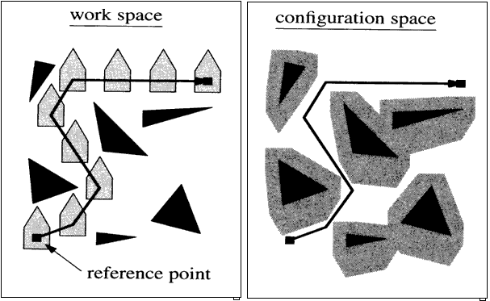
:::
:::::

## Configuration Space

::::: columns
::: {.column width="45%"}
How do we dilate obstacles?

Minkowski Sum

$P \oplus Q = \{p + q \mid p \in P, q \in Q\}$
:::

::: {.column width="55%"}
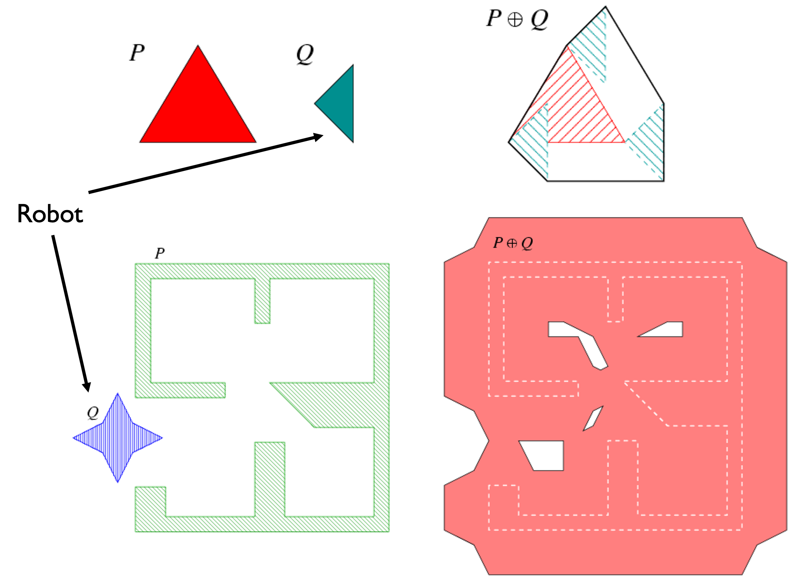
:::
:::::

## Drawbacks of grid-based planners

-   Grid-based planning works well for grids of up to 3-4 dimensions

-   State-space discretization suffers from combinatorial explosion:

-   If the state is $x = [x_1, ... , x_D]$ and we split each dimension into N bins then we will have $N^D$ nodes in the graph.

-   This is not practical for planning paths for robot arms with multiple joints, or other high-dimensional systems.

## Sampling the state-space

-   Need to find ways to reduce the continuous domain into a sparse representation: graphs, trees etc.

-   Today:

-   Rapidly-exploring Random Tree (RRT),

-   Probabilistic RoadMap (PRM)

-   Visibility Planning

-   Smoothing Planned Paths

## RRT

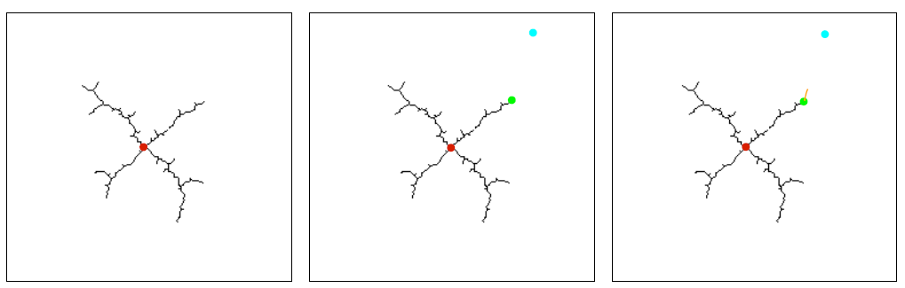

Main idea: maintain a tree of reachable configurations from the root

Main steps:

-   Sample random state
-   Find the closest state (node) already in the tree
-   Steer the closest node towards the random state

## RRT

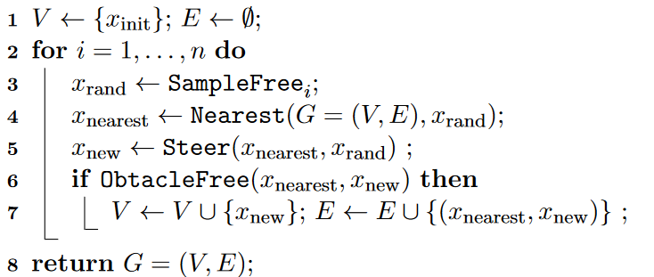

## RRT

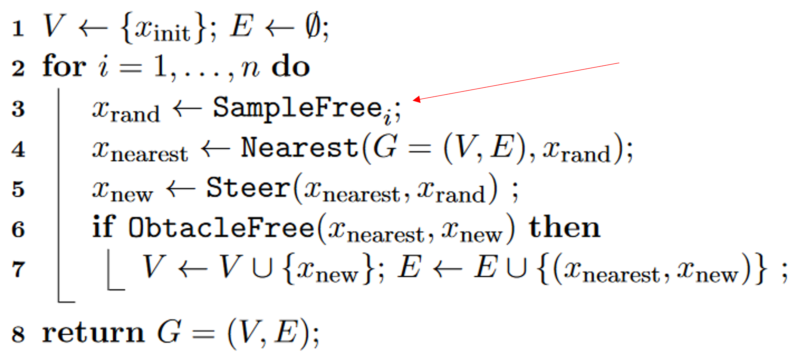{width="900" height="70%"}

::: {.red-annotation .absolute right="0" top="100"}
**Things to pay attention to:**

SampleFree() needs to sample\
a random state from the\
uniform distribution. How do\
you sample rotations uniformly?
:::

## RRT

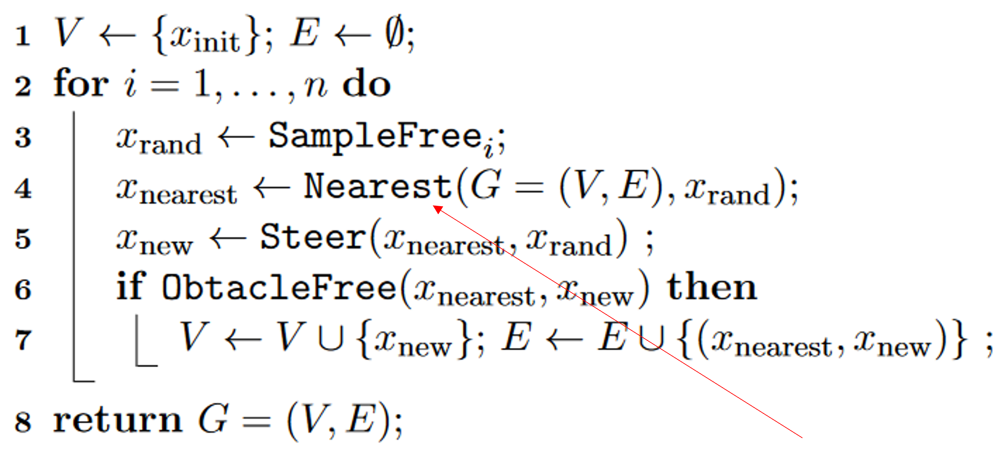{width="900" height="70%"}

[**Things to pay attention to:**]{.red-annotation .absolute right="0" top="80"}

::: {.red-annotation .absolute right="0" bottom="80"}
Nearest() searches for the nearest\
neighbor of a given vector. Brute\
force search examines \|V\| nodes\
(increasing). Is there a more\
efficient method?
:::

## RRT

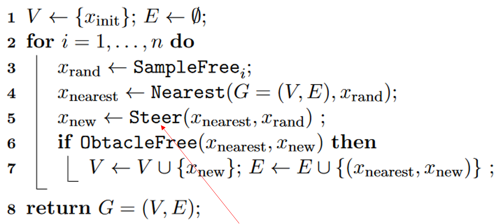{width="900" height="70%"}

[**Things to pay attention to:**]{.red-annotation .absolute right="0" top="80"}

::: {.red-annotation .absolute right="180" bottom="80"}
Steer() finds the controls that take the nearest state\
to the new state. Easy for omnidirectional robots. What\
about non-holonomic systems?
:::

## RRT

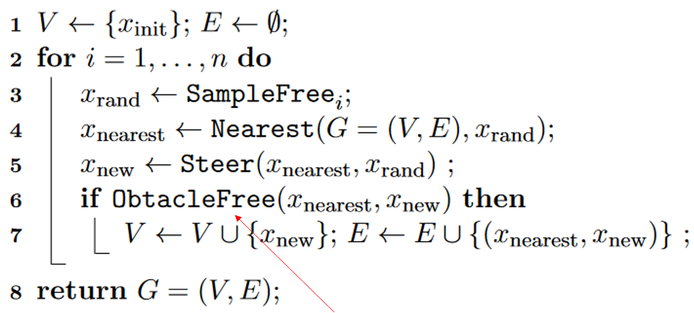{width="900" height="70%"}

[**Things to pay attention to:**]{.red-annotation .absolute right="0" top="80"}

::: {.red-annotation .absolute left="250" bottom="80"}
ObstacleFree() checks the path from the\
nearest state to the new state for collisions.\
How do you do collision checks?
:::

## RRT

{width="900" height="70%"}

[**Things to pay attention to:**]{.red-annotation .absolute right="0" top="80"}

::: {.red-annotation .absolute right="150" bottom="80"}
Upside of using ObstacleFree(): you don’t need to model\
obstacles in Steer(). For example, if Steer() computes LQR\
controllers you don’t need to model obstacles in the control\
computation.
:::

## RRT: uniform sampling

-   Only tricky case is when the state contains rotation components

-   For example: $x = [_B^Wq ^Wp_{W B}]$

-   State involving both rotation and translation components is often called **the pose** of the system.

-   Idea #1: Uniformly sample 3 Euler angles (roll, pitch, yaw)

::::::: columns
::: {.column width="33%"}
:::

::: {.column .red-annotation width="33%"}
3D rotation visualization:\
rotation axis is a point on a sphere,\
rotation angle is the direction\
of the red arrow
:::

:::: {.column .small-font width="33%"}
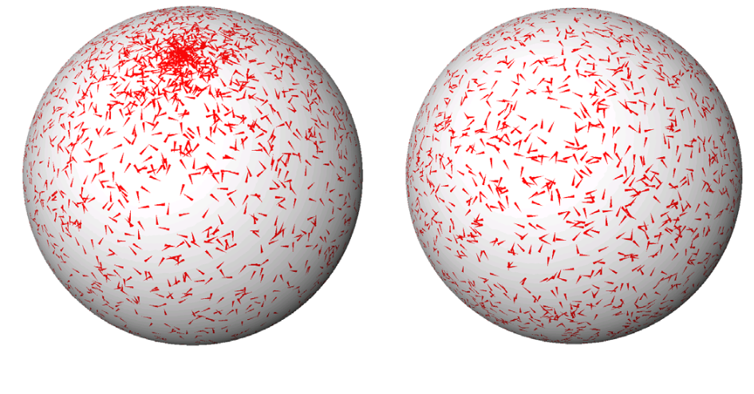

::: horizontal-align
Idea #1\
Not uniform after all

Correct, uniform
:::
::::
:::::::

## RRT: uniform sampling

-   Only tricky case is when the state contains rotation components

-   For example: $x = [_B^Wq ^Wp_{W B}]$

-   State involving both rotation and translation components is often called **the pose** of the system.

-   Idea #1: Uniformly sample 3 Euler angles (roll, pitch, yaw)

::::::: columns
::: {.column width="33%"}
:::

::: {.column .red-annotation width="33%"}
Nonuniformity at the north pole\
caused by Gimbal Lock: same rotation\
parameterized by different Euler angles
:::

:::: {.column .small-font width="33%"}

::: horizontal-align
Idea #1\
Not uniform after all

Correct, uniform
:::
::::
:::::::

## RRT: uniform sampling

-   Idea #2: Uniformly sample a quaternion
-   First, uniformly sample $u_1, u_2, u_3 \in [0,1]$
-   Then output the unit quaternion

$$
\mathbf{q} = [\sqrt{1 - u_1}\sin(2\pi u_2), \sqrt{1 - u_1}\cos(2\pi u_2), \sqrt{u_1}\sin(2\pi u_3), \sqrt{u_1}\cos(2\pi u_3)]
$$

-   Idea #3: Uniformly sample rotation matrices.
-   It’s possible but we won’t discuss it here.

## RRT: finding the nearest neighbor

-   Any alternatives to linear (brute force) search?

. . .

-   Idea #1: space partitioning, e.g. kd-trees

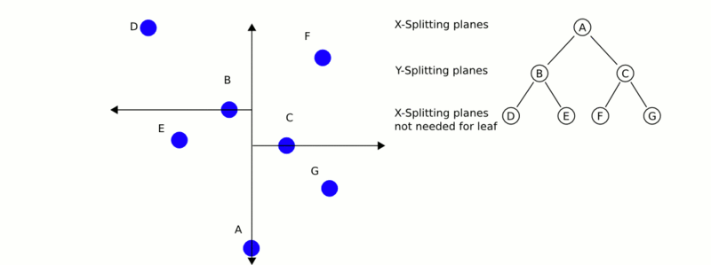

[Each split is done along the median of the\
points on that region]{.red-annotation .absolute bottom="10%" right="20%"}

[Balanced kd-tree:\
Can query in O(logn)]{.red-annotation .absolute right="0" top="30%"}

## RRT: finding the nearest neighbor

-   Any alternatives to linear (brute force) search?
-   Idea #1: space partitioning, e.g. kd-trees
-   Idea #2: locality-sensitive hashing
    -   Maintains buckets
    -   Similar points are placed on the same bucket
    -   When searching consider only points that map to the same bucket

## RRT: steering to a given state

-   This is an optimal control problem, but without a specified time constraint

-   For omnidirectional systems we can connect states by a straight line.

-   For more complicated systems you could use LQR.

-   You could also use a large set of predefined controls, one of which could be able to take the system close to the given state

## RRT: steering to a given state

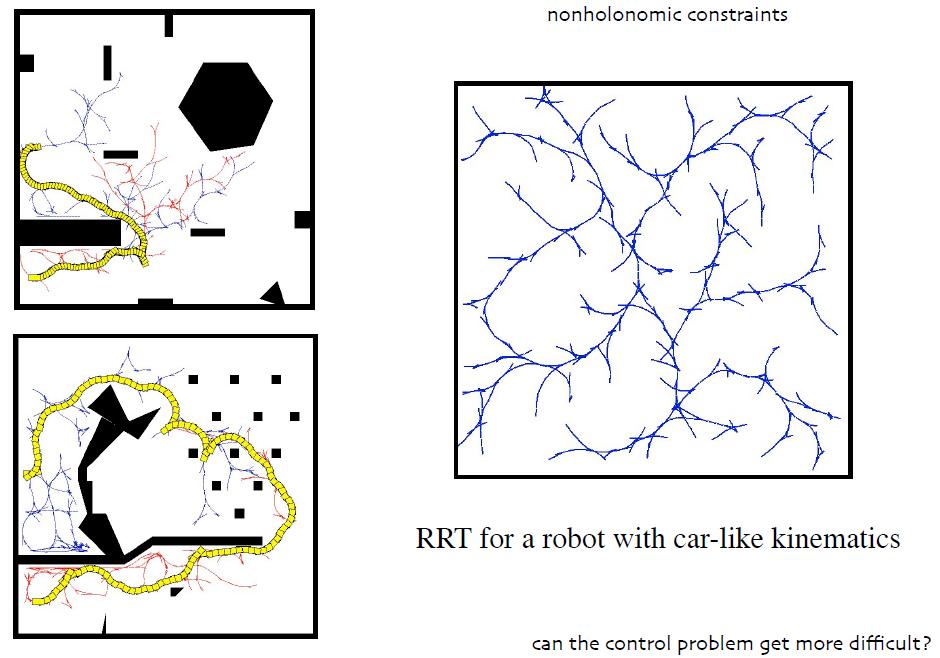{fig-align="center"}

## RRT: collision detection

-   Main idea: bounding volume collision detection

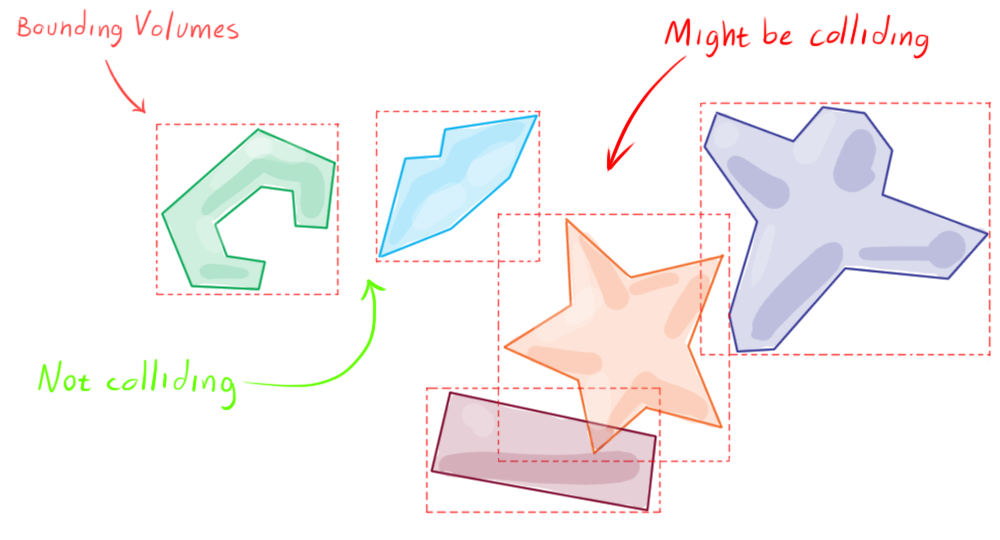

[Source: <https://www.toptal.com/game/video-game-physics-part-ii-collision-detection-for-solid-objects>]{.small-font}

## RRT example: moving a piano



## RRT: properties of the planning algorithm

#1: The RRT will eventually cover the space, i.e. it is a space-filling tree

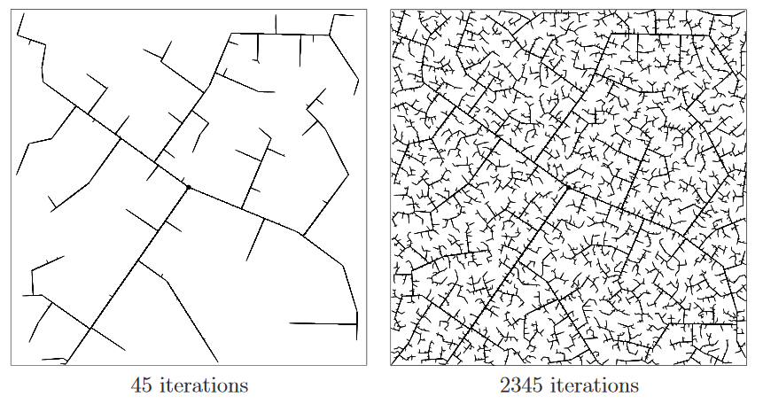{fig-align="center"}

## RRT: properties of the planning algorithm

#1: The RRT will eventually cover the space, i.e. it is a space-filling tree

#2: The RRT will NOT compute the optimal path asymptotically

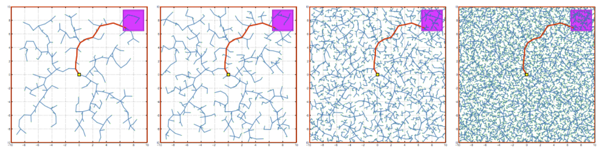

This problem has been addressed in recent years by RRT\*, BIT\*, Fast-Marching Trees

## RRT: properties of the planning algorithm

#1: The RRT will eventually cover the space, i.e. it is a space-filling tree

#2: The RRT will NOT compute the optimal path asymptotically

#3: The RRT will exhibit “Voronoi bias,” i.e. new nodes will fall in free regions of Voronoi diagram (cells consist of points that are closest to a node)

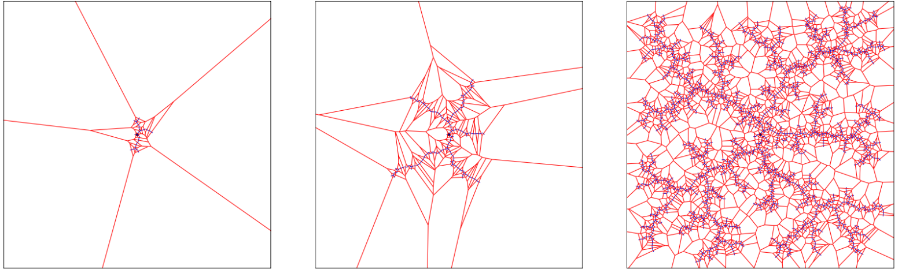

## Voronoi diagram

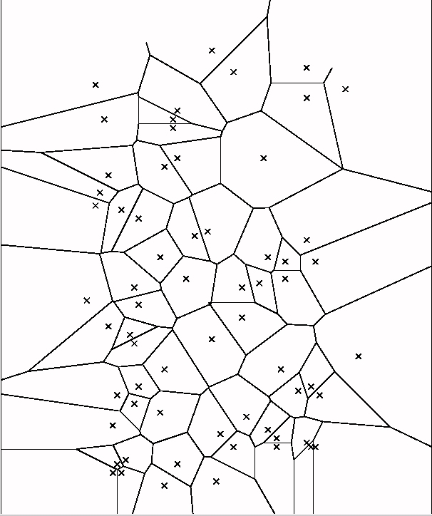

## RRT: properties of the planning algorithm

#1: The RRT will eventually cover the space, i.e. it is a space-filling tree

#2: The RRT will NOT compute the optimal path asymptotically

#3: The RRT will exhibit “Voronoi bias,” i.e. new nodes will fall in free regions of Voronoi diagram

#4: The probability of RRT finding a path increases exponentially in the number of iterations

. . .

#5: The distribution of RRT’s nodes is the same as the distribution used in SampleFree()

## RRT variants: bidirectional search



## Probabilistic RoadMaps (PRMs)

-   RRTs were good for single-query path planning

-   You need to re-plan from scratch for every query A -\> B

-   PRM addresses this problem

-   It is good for multi-query path planning

## PRM

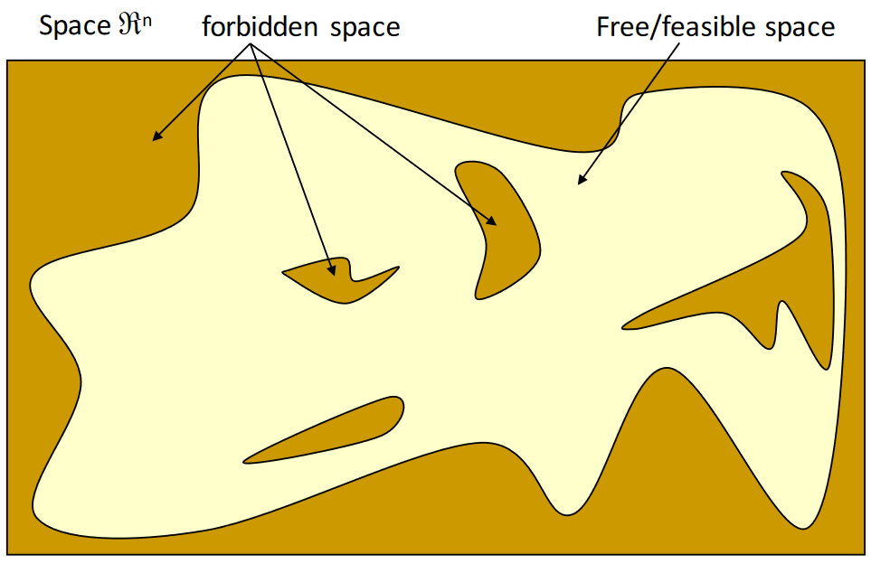{fig-align="center" width="600" height="60%"}

## PRM

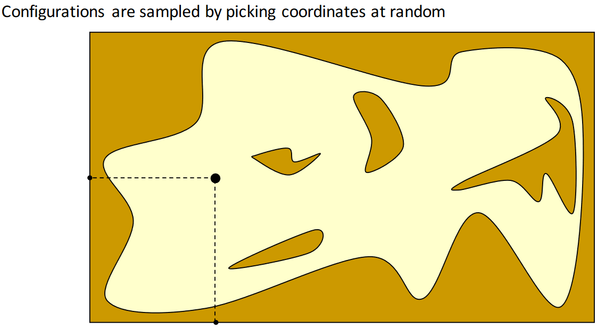{fig-align="center" width="600" height="60%"}

## PRM

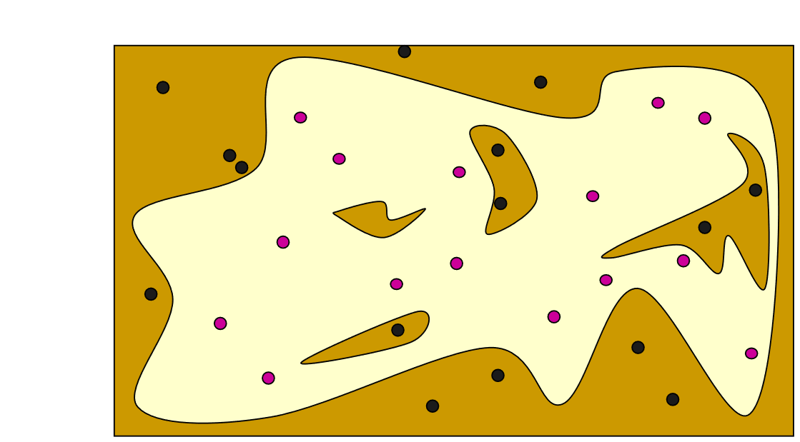{fig-align="center" width="600" height="60%"}

## PRM

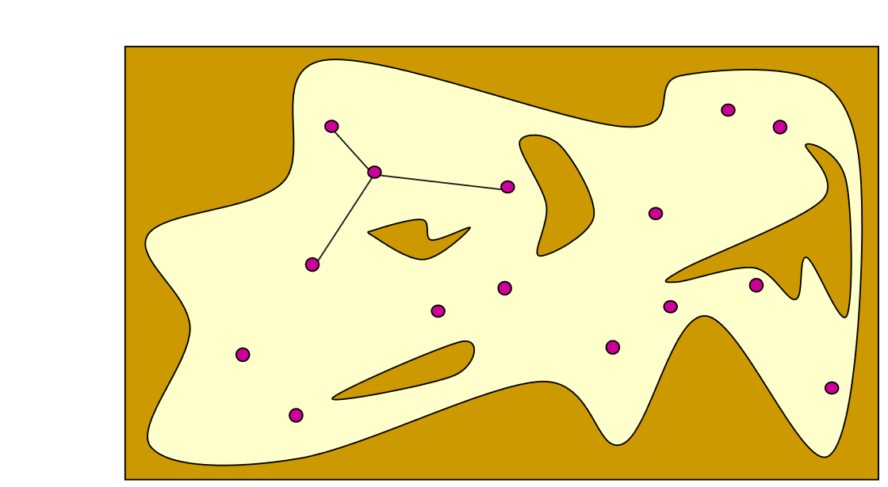{fig-align="center" width="600" height="60%"}

## PRM

::: {.absolute .small-font left="0" top="100"}
In the offline PRM\
construction phase we\
maintain a matrix\
D\[i, j\] which contains the\
total distance of the\
shortest path from node i\
to node j.

We can do this with an\
all pairs shortest paths\
algorithm and then\
incrementally update D\
as new nodes are added.
:::

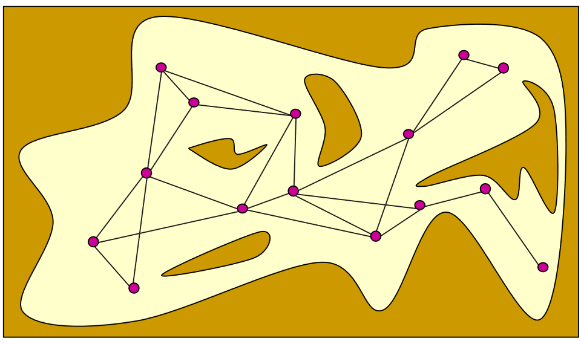{fig-align="center" width="600" height="60%"}

## PRM

::: {.absolute .small-font left="0" top="100"}
In the online PRM\
query phase we\
are given two endpoints\
(not vertices of the graph)\
and we want to find the\
shortest path between them,\
by making use of the matrix\
D\[i, j\] that was precomputed\
in the offline phase.

We can incorporate the\
endpoints in the graph and\
add 1 row and 1 column\
to D
:::

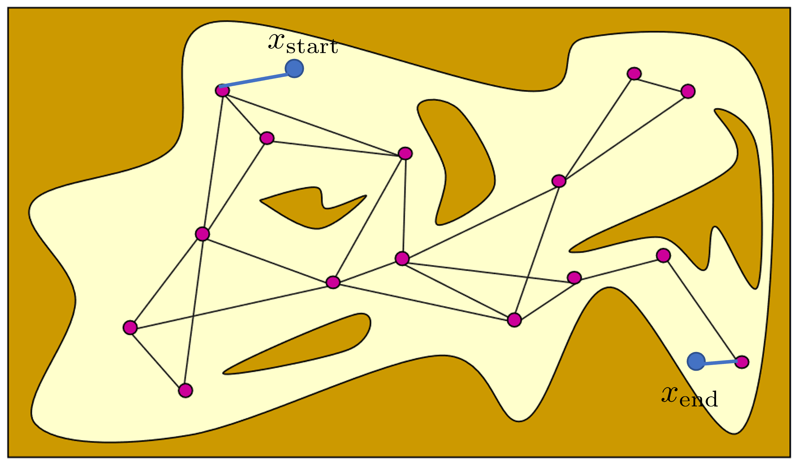{fig-align="center" width="570" height="60%"}

## PRM

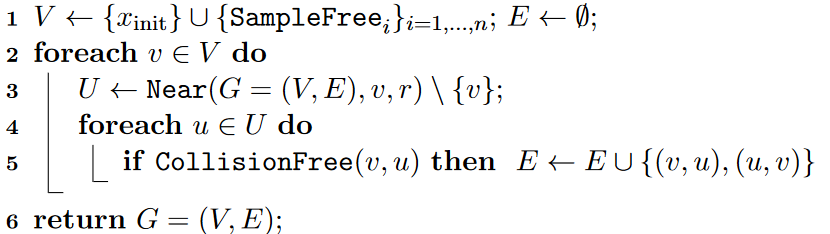{fig-align="center" width="600" height="60%"}

::: red-annotation
To perform a query (A-\>B) we need to connect A and B to the PRM.

We can do this by nearest neighbor search (kd-trees, hashing etc.)
:::

::: {.absolute .fragment right="0" top="100"}
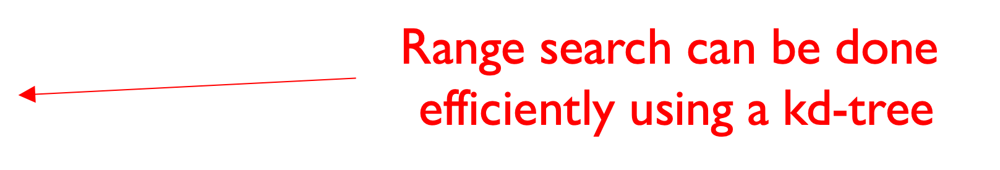{width="450"}
:::

## Visibility Graph Path Planning

-   First, draw lines of sight from the start and goal to all 'visible" vertices and corners of the world.

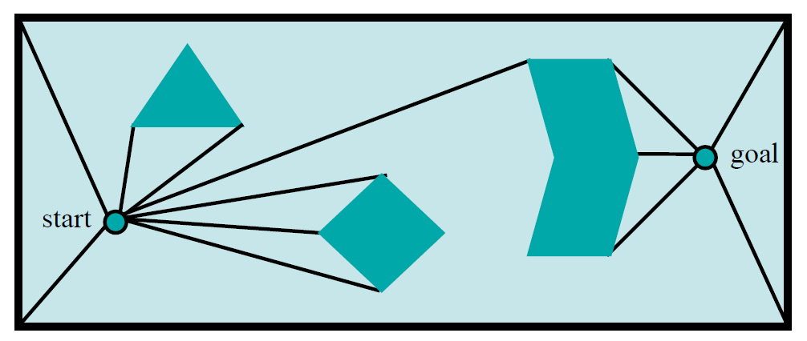{width="65%" height="40%" fig-align="center"}

## Visibility Graph Path Planning

-   Second, draw lines of sight from every vertex of every obstacle like before. Remember lines along edges are also lines of sight.

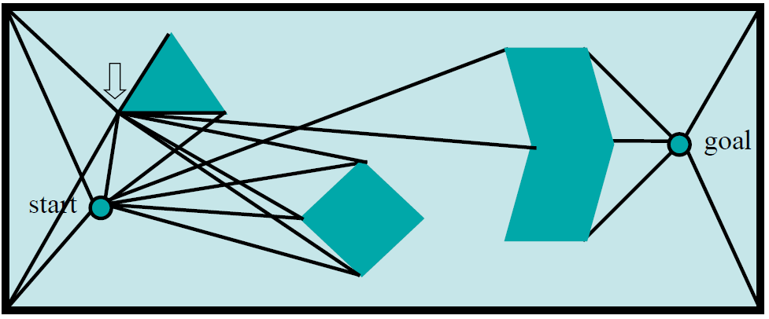{width="65%" height="40%" fig-align="center"}

## Visibility Graph Path Planning

-   Second, draw lines of sight from every vertex of every obstacle like before. Remember lines along edges are also lines of sight.

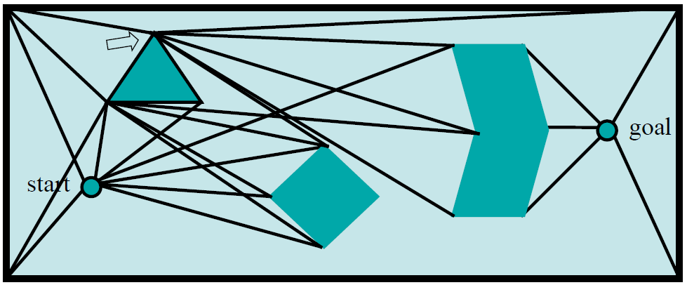{width="65%" height="40%" fig-align="center"}

## Visibility Graph Path Planning

-   Repeat until you're done.

[Visibility graph]{.absolute left="0" top="45%"}

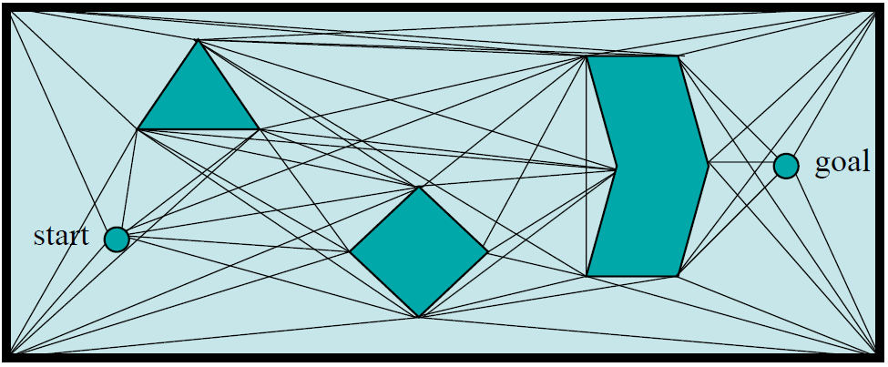{width="65%" height="40%" fig-align="center"}

Can use graph search on visibility graph to find shortest path

## Visibility Graph Path Planning

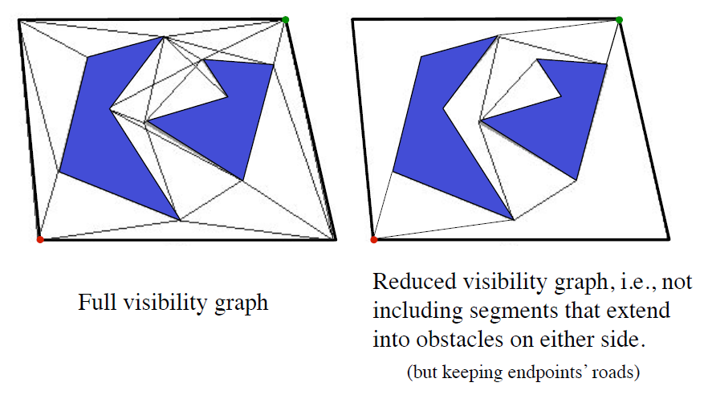{width="75%" height="60%"}

::: {.red-annotation .absolute right="0" top="25%"}
Potential problem:\
shortest path touches\
obstacle corners. Need\
to dilate obstacles.\
:::

## Visibility Graph Path Planning

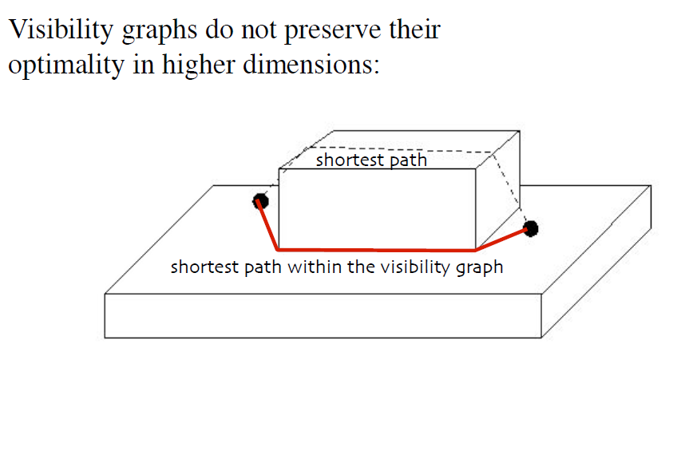

## Path smoothing

-   Plans obtained from any of these planners are not going to be smooth

-   A plan is a sequence of states: $\pi = (\mathbf{x}_{\text{src}}, \mathbf{x}_1, \mathbf{x}_2, \ldots, \mathbf{x}_N, \mathbf{x}_{\text{dest}})$

-   We can get a smoother path $\text{smooth}(\pi) = (\mathbf{x}_{\text{src}}, \mathbf{y}_1, \mathbf{y}_2, \ldots, \mathbf{y}_N, \mathbf{x}_{\text{dest}})$ by minimizing the following cost function

$$
f(\mathbf{y}_1, \ldots, \mathbf{y}_N) = \sum_{t=1}^{N} ||\mathbf{y}_t - \mathbf{x}_t||^2 + \alpha \sum_{t=1}^{N} ||\mathbf{y}_t - \mathbf{y}_{t-1}||^2
$$

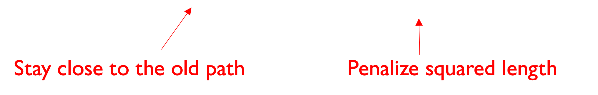{.absolute width="650" height="100" bottom="30%" left="28%"}

 

-   May need to stop smoothing when smooth path comes close to obstacles.