## {.center}

Conceptual slides adapted from: <http://courses.csail.mit.edu/6.141/spring2014/pub/lectures/Lec05-ROS-Lecture.pptm>

Updated for ROS 2, with the tools and concepts you will need for Assignment 1.

## Outline

1. What is ROS, and why does robotics use it?
2. ROS 1 vs. ROS 2: what changed, what did not
3. Setting up ROS 2 for Assignment 1
4. Anatomy of a ROS 2 node in Python (`rclpy`)
5. The messages you need: `LaserScan`, `Twist`, `Float32`
6. Working with laser scans: geometry, sectors, frames
7. Anatomy of a controller node
8. Parameters, launch files, bags, and debugging tools
9. Gazebo and rviz2
10. Exercises in `tutorials/w02/code`

# Part 1: What is ROS? {.center}

## A meta-operating system for robots

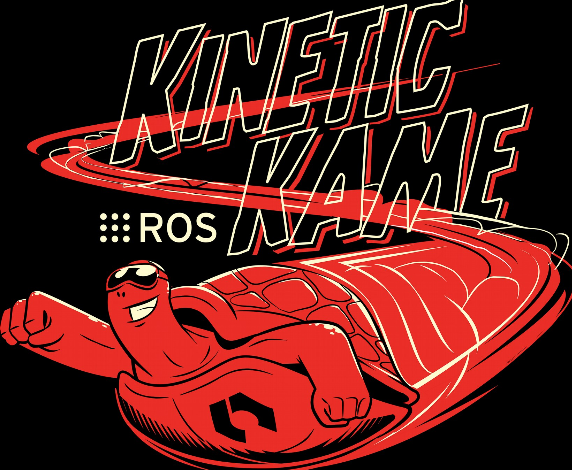

## What is ROS?

-   A "meta" operating system: not a kernel, but the glue between processes on one or many computers.
-   Open source (Apache 2.0 for ROS 2 core; BSD for ROS 1).
-   Runs best on Ubuntu Linux; ROS 2 also has Windows and macOS support.
-   **Nodes**: small processes, each doing one job.
-   **Message passing**
    -   Publish / subscribe on *topics* (asynchronous streams)
    -   *Services* (request / response)
    -   *Actions* (long-running goals with feedback; ROS 2 makes these first class)
-   Many languages: C++ (`rclcpp`) and Python (`rclpy`) are the official ones; Rust, Java and others exist.

## What is ROS?

::: {.columns}
::: {.column .medium-font}
-   Low level device abstraction
    -   Joystick
    -   GPS
    -   Camera
    -   Controllers
    -   Laser Scanners
    -   …

-   Application building blocks
    -   Coordinate system transforms (`tf2`)
    -   Visualization tools (`rviz2`, `rqt`)
    -   Debugging tools (`ros2 topic`, `ros2 bag`)
    -   Robust navigation stack (Nav2, SLAM Toolbox)
    -   Arm path planning (MoveIt 2)
    -   Object recognition
    -   ... 
:::

::: {.column}
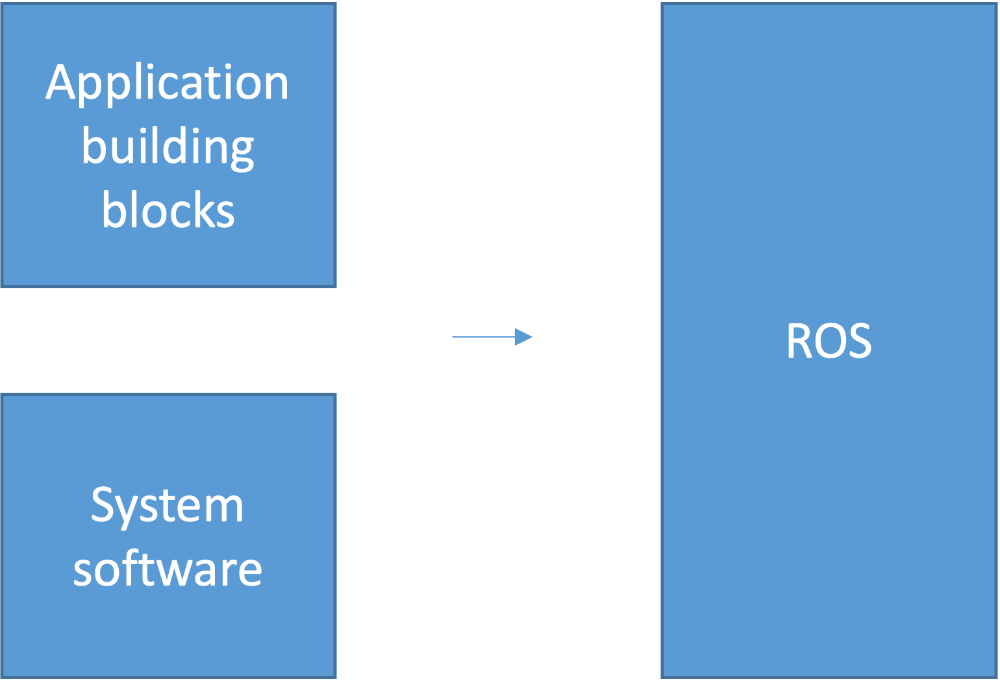
:::
::: 

## What is ROS?

- Software management (compiling, packaging, dependency resolution)
- Remote communication and control

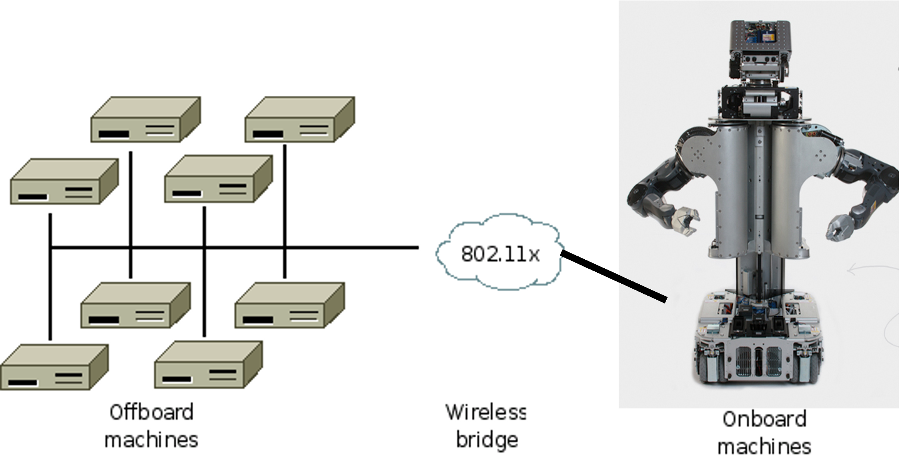

## What is ROS?

- Started at Stanford (2007), developed by Willow Garage, now maintained by Open Robotics / the OSRA.
- Exponential adoption
- Countless commercial, hobby, and academic robots use ROS (<https://robots.ros.org>)

:::{layout="[45, -5, 45]"}
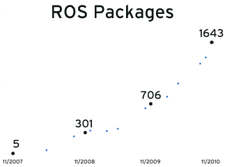

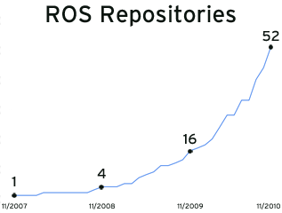

:::

## ROS philosophical goals

- "Hardware agnosticism": the same controller code runs in Gazebo and on a real Husky.
- Peer to peer
- Tools based software design
- Multiple language support (C++ / Python)
- Lightweight: runs only at the edge of your modules
- Free and open source
- Suitable for large scale research and industry

## Conceptual levels of design

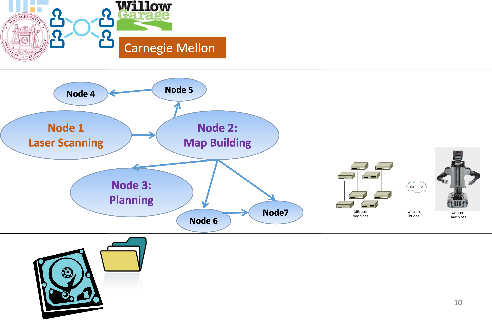

:::{.medium-font .absolute right="100" top=100}
[**(A) ROS Community:**]{.underline} ROS Distributions, Repositories
:::

:::{.medium-font .absolute right="100" top=250}
[**(B) Computation Graph:**]{.underline} Peer-to-Peer Network of \
ROS nodes (processes).
:::

:::{.medium-font .absolute right="100" bottom=50}
[**(C) File-system level:**]{.underline} ROS Tools for managing source code, \
build instructions, and message definitions.
:::

## Tools-based software design

Tools for:

- Building ROS packages (`colcon build`)
- Running ROS nodes (`ros2 run`, `ros2 launch`)
- Viewing network topology (`rqt_graph`)
- Monitoring network traffic (`ros2 topic`)
- Recording and replaying data (`ros2 bag`)

Many cooperating processes, instead of a single monolithic program.

## Multiple language support

::: {.columns}
::: {.column width="30%"}
- ROS is implemented natively in each language, on top of a shared C core (`rcl`).
- Quickly define messages in a language-independent format (`.msg` files).


:::

::: {.column width="70%"}
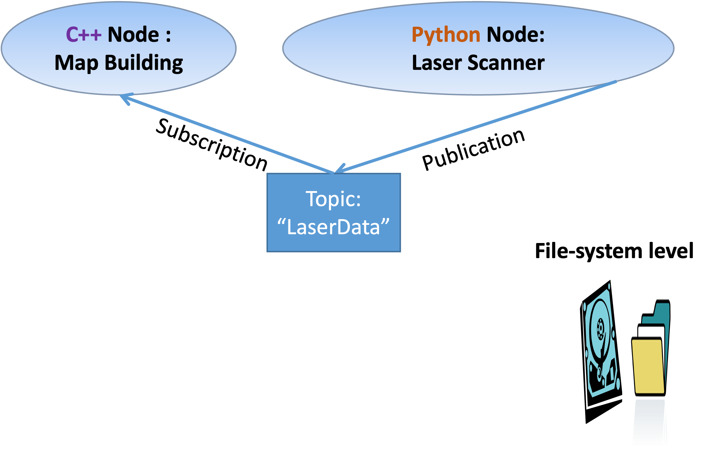
:::
::: 

## Lightweight

-   Encourages standalone libraries with no ROS dependencies: \
    *Don't* *put ROS dependencies in the core of your algorithm!*

-   Use ROS only at the *edges* of your interconnected software modules: Downstream/Upstream interface.
    -   For Assignment 1: write your `PID` class as plain Python. Only the node that subscribes and publishes should import `rclpy`.

-   ROS re-uses code from a variety of projects:
    -   OpenCV : Computer Vision Library
    -   Point Cloud Library (PCL) : 3D Data Processing
    -   MoveIt 2 : Motion Planning

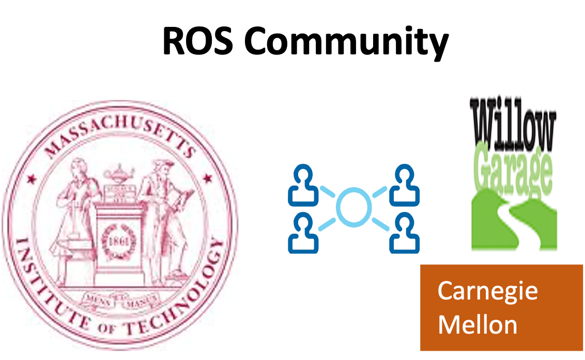{.absolute width="250" bottom=50 right="50"}

## Peer to peer messaging

-   No central server through which messages are routed.
-   ROS 2: **no master at all**. Nodes discover each other automatically through DDS (Data Distribution Service) on the local network.
-   Messaging types:
    -   Topics : *asynchronous* data streaming (many-to-many)
    -   Services : synchronous request / reply
    -   Actions : goals with feedback and cancellation
    -   Parameters : per-node configuration values, settable at runtime

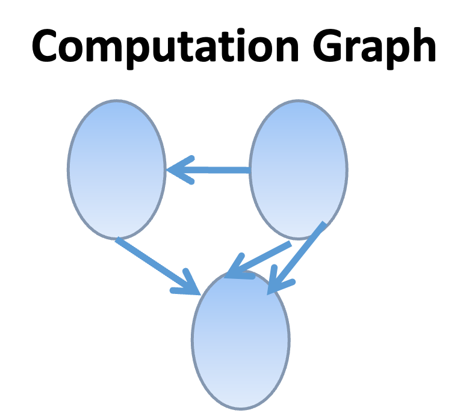{.absolute width="150" bottom=50 right="50"}

## Peer to peer messaging 

- [**Discovery:**]{.underline} DDS multicasts "I exist, I publish X"; nodes on the same `ROS_DOMAIN_ID` find each other. No `roscore`.

- [**Publish:**]{.underline} Will not block until receipt, messages get queued.

- [**Quality of Service (QoS):**]{.underline} Each publisher and subscriber declares a QoS profile: history depth (queue size), *reliable* vs. *best effort*, durability. **Publisher and subscriber QoS must be compatible or you silently receive nothing.**
    - Sensor drivers and Gazebo publish laser scans as *best effort*. Subscribe with `qos_profile_sensor_data`.

- [**Transport:**]{.underline} UDP by default (DDS), shared memory on the same machine.

{.absolute width="150" bottom=50 right="50"}

## Free & open source

- Permissive licenses : can develop commercial applications
- Drivers (cameras, lidars, joysticks, IMUs, and others)
- Perception, planning, control libraries (Nav2, MoveIt 2, ros2_control)
- Interfaces to other libraries: OpenCV, PCL, etc.

# Part 2: ROS 1 vs. ROS 2 {.center}

## Why ROS 2?

ROS 1 (2007 to 2025) was built for a single robot, on a single trusted network, with a single central master.

ROS 2 (2017 onwards) was redesigned for:

- **Multi-robot systems and unreliable networks**: DDS middleware, no master, QoS policies.
- **Real time and embedded**: C core, deterministic executors, micro-ROS on microcontrollers.
- **Security**: authentication and encryption between nodes (SROS2).
- **Production use**: lifecycle-managed nodes, first-class actions, typed parameters.
- **Cross platform**: Linux, Windows, macOS.

ROS 1 Noetic reached end of life in **May 2025**. Everything new is ROS 2.

## ROS 2 distributions

| Distro | Ubuntu | Released | Supported until | Gazebo |
|---|---|---|---|---|
| Humble Hawksbill (LTS) | 22.04 | May 2022 | May 2027 | Fortress |
| Jazzy Jalisco (LTS) | 24.04 | May 2024 | May 2029 | Harmonic |
| Kilted Kaiju | 24.04 | May 2025 | Nov 2026 | Ionic |
| Lyrical Luth (LTS) | 26.04 | May 2026 | May 2031 | Jetty |

- One distro per Ubuntu release; **do not** mix a distro with a different Ubuntu version.
- For this course we recommend **Jazzy on Ubuntu 24.04**. Humble also works. Lyrical is very new, so fewer packages are available yet.
- Check yours with `echo $ROS_DISTRO`.

## What stays the same

The *concepts* from ROS 1 carry over almost unchanged:

- Nodes, topics, publishers, subscribers, services, messages, parameters
- Message definitions: `sensor_msgs/LaserScan`, `geometry_msgs/Twist`, `std_msgs/Float32` are the same fields
- `tf2` coordinate frame tree, `rviz` (now `rviz2`), `rqt` tools, bag files
- Gazebo simulation, URDF robot descriptions
- Package structure: a folder with `package.xml` and build instructions

So old ROS 1 tutorials and Stack Overflow answers are still useful for *ideas*; only the commands and the client-library API differ.

## Command cheat sheet: ROS 1 to ROS 2

::: {.columns}
::: {.column width="50%" .medium-font}
- `roscore` → *(nothing; no master)*
- `catkin_make` → `colcon build`
- `source devel/setup.bash` → `source install/setup.bash`
- `rosrun pkg node` → `ros2 run pkg node`
- `roslaunch pkg f.launch` → `ros2 launch pkg f.launch.py`
- `rostopic list / echo / hz` → `ros2 topic list / echo / hz`
- `rosnode list / info` → `ros2 node list / info`
- `rosmsg show T` → `ros2 interface show T`
:::

::: {.column width="50%" .medium-font}
- `rosparam set` → `ros2 param set`
- `dynamic_reconfigure` → node parameters + `rqt_reconfigure`
- `rosbag record / play` → `ros2 bag record / play`
- `rosrun rviz rviz` → `rviz2`
- `rosrun tf tf_echo a b` → `ros2 run tf2_ros tf2_echo a b`
- `rqt_graph` → `rqt_graph` (unchanged)
- `import rospy` → `import rclpy`
- `#include <ros/ros.h>` → `#include <rclcpp/rclcpp.hpp>`
:::
:::

## Python API: `rospy` vs. `rclpy`

::: {.columns}
::: {.column width="50%"}
ROS 1
```python
import rospy
from std_msgs.msg import Float32

rospy.init_node("scan_stats")
pub = rospy.Publisher("/closest", Float32,
                      queue_size=10)

def cb(scan):
    pub.publish(Float32(data=min(scan.ranges)))

rospy.Subscriber("/scan", LaserScan, cb)
rospy.spin()
```
:::

::: {.column width="50%"}
ROS 2
```python
import rclpy
from rclpy.node import Node
from std_msgs.msg import Float32

class ScanStats(Node):
    def __init__(self):
        super().__init__("scan_stats")
        self.pub = self.create_publisher(
            Float32, "/closest", 10)
        self.create_subscription(
            LaserScan, "/scan", self.cb, 10)

    def cb(self, scan):
        self.pub.publish(Float32(data=min(scan.ranges)))

rclpy.init()
rclpy.spin(ScanStats())
```
:::
:::

Main difference: in ROS 2 everything hangs off a `Node` object instead of module-level functions.

# Part 3: Setting up ROS 2 for Assignment 1 {.center}

## Install options

1. **Ubuntu 24.04 (native or dual boot)** with Jazzy. Best experience, especially for Gazebo and rviz2.
    - Follow <https://docs.ros.org/en/jazzy/Installation/Ubuntu-Install-Debs.html>
    - `sudo apt install ros-jazzy-desktop ros-jazzy-ros-gz python3-colcon-common-extensions python3-rosdep`
2. **Lab machines**: ROS 2 and Gazebo are installed. Use VNC or run locally in the lab.
3. **macOS / Windows**: run Ubuntu 24.04 in a VM (UTM, VirtualBox, WSL2 with WSLg) or in Docker (`osrf/ros:jazzy-desktop-full`). Gazebo needs a GPU or software rendering (`LIBGL_ALWAYS_SOFTWARE=1`), so expect it to be slow.

Sanity check after installing:

```bash
source /opt/ros/jazzy/setup.bash
ros2 run demo_nodes_cpp talker      # terminal 1
ros2 run demo_nodes_py listener     # terminal 2
```

## Workspace layout

```bash
mkdir -p ~/csc477_ws/src
cd ~/csc477_ws/src
git clone <assignment starter code repo>
cd ~/csc477_ws
rosdep install --from-paths src --ignore-src -r -y   # pull in dependencies
colcon build --symlink-install
source install/setup.bash
```

- `src/` holds packages; `build/`, `install/`, `log/` are generated by `colcon`.
- `--symlink-install` means edits to Python files and launch files take effect without rebuilding.
- Add to `~/.bashrc` so every new terminal is ready:

```bash
source /opt/ros/jazzy/setup.bash
source ~/csc477_ws/install/setup.bash
```

- Rebuild only what changed: `colcon build --packages-select wall_following_assignment`.

## Anatomy of a Python package

```
csc477_tut02/
├── package.xml            # name, version, dependencies (rclpy, sensor_msgs, ...)
├── setup.py               # entry points: "obstacle_monitor = csc477_tut02.obstacle_monitor:main"
├── setup.cfg
├── resource/csc477_tut02  # marker file used by ament
├── launch/
│   └── tut02.launch.py
└── csc477_tut02/
    ├── __init__.py
    ├── minimal_publisher.py
    └── obstacle_monitor.py
```

- `ros2 pkg create --build-type ament_python --dependencies rclpy sensor_msgs my_pkg` generates this skeleton.
- Each entry point in `setup.py` becomes an executable: `ros2 run csc477_tut02 obstacle_monitor`.
- C++ packages use `ament_cmake` and a `CMakeLists.txt` instead of `setup.py`.

# Part 4: Anatomy of a ROS 2 node {.center}

## A minimal publisher

```python
import rclpy
from rclpy.node import Node
from std_msgs.msg import String

class MinimalPublisher(Node):
    def __init__(self):
        super().__init__("minimal_publisher")          # node name
        self.pub = self.create_publisher(String, "chatter", 10)   # type, topic, queue depth
        self.timer = self.create_timer(0.5, self.on_timer)        # period in seconds
        self.count = 0

    def on_timer(self):
        msg = String()
        msg.data = f"Hello ROS 2: {self.count}"
        self.pub.publish(msg)
        self.get_logger().info(f'Publishing: "{msg.data}"')
        self.count += 1

def main():
    rclpy.init()
    node = MinimalPublisher()
    rclpy.spin(node)          # blocks; runs timer and subscription callbacks
    node.destroy_node()
    rclpy.shutdown()
```

## A minimal subscriber

```python
import rclpy
from rclpy.node import Node
from std_msgs.msg import String

class MinimalSubscriber(Node):
    def __init__(self):
        super().__init__("minimal_subscriber")
        self.sub = self.create_subscription(String, "chatter", self.on_msg, 10)

    def on_msg(self, msg: String):
        self.get_logger().info(f'I heard: "{msg.data}"')

def main():
    rclpy.init()
    rclpy.spin(MinimalSubscriber())
    rclpy.shutdown()
```

- Callbacks are only run while the node is being *spun*. If your node never prints anything, check that you called `rclpy.spin`.
- Topic names and types must match exactly: `ros2 topic info /chatter` shows publishers, subscribers, and the type.

## Execution model

- `rclpy.spin(node)`: single-threaded executor. Callbacks run one at a time, in the order events arrive. Simple and sufficient for Assignment 1.
- A long computation inside a callback delays *all* other callbacks (including the next laser scan). Keep callbacks short.
- `rclpy.spin_once(node, timeout_sec=...)` if you need your own loop.
- Multi-threaded executors and callback groups exist for when you need concurrency; not needed here.

Logging levels: `self.get_logger().debug / info / warn / error`. Filter at runtime with `--ros-args --log-level debug`.

## Time and timestamps

```python
now = self.get_clock().now()                 # rclpy.time.Time
t   = rclpy.time.Time.from_msg(scan.header.stamp)
dt  = (now - self.last_time).nanoseconds * 1e-9
```

- Every sensor message has a `header.stamp` (when it was measured) and `header.frame_id` (which coordinate frame).
- Use timestamps, not `time.time()`, to compute `dt` in a controller: simulation may run slower or faster than wall clock.
- In Gazebo, nodes should use *simulated* time: launch with parameter `use_sim_time: true` and the `/clock` topic drives `get_clock()`. WHY?

# Part 5: The messages you need {.center}

## Inspecting message types

```bash
ros2 interface show sensor_msgs/msg/LaserScan
ros2 interface show geometry_msgs/msg/Twist
ros2 interface show std_msgs/msg/Float32
ros2 interface list | grep -i laser
```

Assignment 1 data flow:

```{mermaid}
%%| fig-width: 10
%%| fig-height: 5
flowchart LR
    Gazebo["Gazebo: Husky + lidar"] -->|"LaserScan"| Scan["/husky_1/scan"]
    Scan --> Node["your node"]
    Node -->|"Float32"| Cte["/husky_1/cte"]
    Node -->|"Twist"| Cmd["/husky_1/cmd_vel"]
    Cmd --> Gazebo
    Cte --> Bag["ros2 bag / rqt_plot"]
```

## `sensor_msgs/msg/LaserScan`

```text
std_msgs/Header header      # stamp, frame_id (e.g. "laser")
float32 angle_min           # start angle of the scan [rad]
float32 angle_max           # end angle of the scan [rad]
float32 angle_increment     # angular distance between measurements [rad]
float32 time_increment      # time between measurements [s]
float32 scan_time           # time between scans [s]
float32 range_min           # minimum valid range [m]
float32 range_max           # maximum valid range [m]
float32[] ranges            # range data [m]  (len = (angle_max-angle_min)/angle_increment + 1)
float32[] intensities       # may be empty
```

- Beam `i` is at angle $\theta_i = \text{angle_min} + i \cdot \text{angle_increment}$ in the `frame_id` frame.
- Values outside `[range_min, range_max]`, or `inf` / `nan`, mean "no return": **filter them out** before taking a minimum.

## Frame conventions (REP 103)

::: {.columns}
::: {.column width="55%"}
- Robot body frame `base_link`: **x forward, y left, z up**.
- Angles are counter-clockwise about z: $\theta = 0$ is straight ahead, $\theta = +\pi/2$ is the **left**, $\theta = -\pi/2$ is the right.
- The Husky lidar frame is usually aligned with `base_link` (check with `ros2 run tf2_ros tf2_echo base_link laser`).
- So the wall on the robot's left shows up in the beams with $\theta \approx +\pi/2$.
- Units: meters, radians, seconds. `Twist.linear.x` is m/s, `Twist.angular.z` is rad/s (positive = turn left).
:::

::: {.column width="45%"}

:::
:::

## `geometry_msgs/msg/Twist` and `std_msgs/msg/Float32`

```python
from geometry_msgs.msg import Twist
from std_msgs.msg import Float32

cmd = Twist()
cmd.linear.x  = 1.0       # forward speed [m/s]; differential drive: linear.y is ignored
cmd.angular.z = omega     # yaw rate [rad/s], output of your controller
self.cmd_pub.publish(cmd)

err_msg = Float32()
err_msg.data = float(error) # ROS 2 checks types: numpy.float64 must be cast to float
self.err_pub.publish(err_msg)
```

- A differential drive robot can only realize `linear.x` and `angular.z`.
- The velocity controller stops the robot if it does not receive commands for a while: publish on every scan callback.

# Part 6: Working with laser scans {.center}

## From ranges to geometry

```python
import numpy as np

def scan_to_arrays(scan):
    ranges = np.asarray(scan.ranges, dtype=float)
    angles = scan.angle_min + np.arange(len(ranges)) * scan.angle_increment
    valid = np.isfinite(ranges) & (ranges >= scan.range_min) & (ranges <= scan.range_max)
    return angles[valid], ranges[valid]

def polar_to_cartesian(angles, ranges):
    # points in the laser frame: x forward, y left
    return ranges * np.cos(angles), ranges * np.sin(angles)
```

- Work with `numpy` arrays, not Python loops: scans have 700+ beams at 10 to 50 Hz.
- Always filter first. A single `inf` in `np.min` or `np.mean` silently poisons the result.
- Cartesian points are what you need for fitting lines (least squares, Tutorial 3), building maps, or drawing in `rviz2` as a `Marker`.

## Sector summaries

Robots rarely need all 700 beams. Summarize a scan by angular sectors:

```python
def sector_min(angles, ranges, center, half_width):
    """Closest valid return within +/- half_width of `center` (radians), or None."""
    window = np.abs(angles - center) < half_width
    return float(ranges[window].min()) if window.any() else None

front_clearance = sector_min(angles, ranges, center=0.0, half_width=np.deg2rad(15))
```

- Front clearance is the basis of every emergency stop: `if front_clearance < 0.5: stop`.
- A sector minimum is robust to single noisy beams; a single beam is not. Consider a low percentile instead of `min` for very noisy sensors.
- Handle the `None` case: an open doorway or an out-of-range wall is not an error.
- Assignment 1 asks you to turn a scan into a scalar error for a controller. Which beams, which statistic, and what sign convention is your design decision; think about it with the sim in Gazebo and `ros2 topic echo` in front of you.

## Points live in frames

A lidar mounted at $(x_L, y_L)$ with yaw $\psi_L$ on the robot reports points in the `laser` frame. To use them together with odometry or a map they must be expressed in `base_link` or `odom`:

$$
\begin{bmatrix} x_b \\ y_b \\ 1 \end{bmatrix}
=
\underbrace{\begin{bmatrix} \cos\psi_L & -\sin\psi_L & x_L \\ \sin\psi_L & \cos\psi_L & y_L \\ 0 & 0 & 1 \end{bmatrix}}_{T^{b}_{L}}
\begin{bmatrix} x_L' \\ y_L' \\ 1 \end{bmatrix}
$$

- $T^{b}_{L}$ reads "the pose of `laser` expressed in `base_link`"; it maps laser-frame points to body-frame points.
- Chain transforms by multiplication: $T^{o}_{L} = T^{o}_{b}\, T^{b}_{L}$. Invert to go back: $T^{L}_{b} = (T^{b}_{L})^{-1}$.
- This is exactly what `tf2` stores and looks up for you, over time. `ros2 run tf2_ros tf2_echo base_link laser` prints $T^{b}_{L}$.
- Exercise 2 in `code/standalone` makes you build, chain, and invert these matrices by hand.

# Part 7: Anatomy of a controller node {.center}

## The plumbing, not the math

A closed-loop controller in ROS 2 is a subscriber callback that publishes a command:

```python
class MyController(Node):
    def __init__(self):
        super().__init__("my_controller")
        self.declare_parameter("gain", 1.0)                       # tunable at runtime
        self.cmd_pub = self.create_publisher(Twist, "cmd_vel", 10)
        self.dbg_pub = self.create_publisher(Float32, "error", 10)  # for plotting / bagging
        self.create_subscription(LaserScan, "scan", self.on_scan, qos_profile_sensor_data)
        self.last_stamp = None

    def on_scan(self, scan: LaserScan):
        stamp = Time.from_msg(scan.header.stamp)
        dt = 0.0 if self.last_stamp is None else (stamp - self.last_stamp).nanoseconds * 1e-9
        self.last_stamp = stamp
        error = ...                       # your perception code: scan -> scalar
        u = ...                           # your control law: error, dt, gains -> command
        self.dbg_pub.publish(Float32(data=float(error)))
        cmd = Twist(); cmd.linear.x = 1.0; cmd.angular.z = float(u)
        self.cmd_pub.publish(cmd)
```

- Perception and control are plain functions with no `rclpy` in them: unit test them without ROS.
- Publish your intermediate signal (the error) on its own topic. It costs nothing and you will need it for tuning, `rqt_plot`, and `ros2 bag`.

## Practical control details in ROS 2

- **`dt` from timestamps**, not wall-clock time: Gazebo may run slower or faster than real time. With `use_sim_time: true`, `get_clock().now()` follows `/clock`.
- **Rate**: you publish one command per scan (10 to 50 Hz). Missing messages (QoS mismatch) or a slow callback shows up as a lower rate in `ros2 topic hz cmd_vel`.
- **Saturation**: real robots have velocity limits. Clamp your output and know when it is clamped.
- **Integrators and windup**: if you accumulate anything over time, clamp it and reset it when parameters change or the robot is teleoperated.
- **Startup**: the first callback has no history (`dt = 0`, no previous error). Guard against division by zero.
- **Watchdogs**: velocity controllers stop the robot when commands stop arriving. Publishing nothing is a safe default; publishing a stale command is not.

## A workflow for Assignment 1

1. **Bring up the simulation and look before you code**: `ros2 topic list`, `ros2 topic echo --once /husky_1/scan`, `ros2 topic hz`, `rviz2` with the `LaserScan` display.
2. **Teleoperate** and watch the scan change as you drive toward and away from walls. Convince yourself which beam indices see which side of the robot.
3. **Perception first**: write and test the scan-to-scalar function on a recorded bag (`ros2 bag record /husky_1/scan`, then replay), publish it, plot it with `rqt_plot`.
4. **Control second**: start with one gain, make it a parameter, tune with `ros2 param set` while the robot drives. Record the error topic for every run.
5. Only then worry about corners and edge cases. Keep a log of what each parameter set did.

```bash
ros2 run teleop_twist_keyboard teleop_twist_keyboard --ros-args -r cmd_vel:=/husky_1/cmd_vel
```

# Part 8: Parameters, launch files, bags, debugging {.center}

## Configuring Parameters 

```python
from rcl_interfaces.msg import SetParametersResult

class MyController(Node):
    def __init__(self):
        super().__init__("my_controller")
        self.declare_parameter("gain", 1.0)
        self.gain = self.get_parameter("gain").value
        self.add_on_set_parameters_callback(self.on_params)   # runs BEFORE the change is applied

    def on_params(self, params):
        for p in params:
            if p.name == "gain":
                if p.value < 0.0:
                    return SetParametersResult(successful=False, reason="gain must be >= 0")
                self.gain = p.value                              # reset any accumulated state here too
                self.get_logger().info(f"gain <- {p.value}")
        return SetParametersResult(successful=True)
```

```bash
ros2 param list /my_controller
ros2 param get /my_controller gain
ros2 param set /my_controller gain 2.5        # takes effect immediately via the callback
ros2 param dump /my_controller > tuned.yaml   # save what worked; load with --params-file
ros2 run rqt_reconfigure rqt_reconfigure      # GUI sliders (Part C of A1)
```

- Parameters are typed: declaring `gain` as `1.0` (float) means `ros2 param set gain 2` (int) is rejected. Always pass `2.0`.
- Give parameters a `ParameterDescriptor` with a `floating_point_range` and `rqt_reconfigure` shows a slider (see `param_demo.py`).

## Launch files (Python)

```python
# launch/wall_follower.launch.py
from launch import LaunchDescription
from launch.actions import DeclareLaunchArgument
from launch.substitutions import LaunchConfiguration
from launch_ros.actions import Node

def generate_launch_description():
    return LaunchDescription([
        DeclareLaunchArgument("desired_distance", default_value="1.0"),
        Node(
            package="wall_following_assignment",
            executable="wall_follower",
            name="wall_follower",
            output="screen",
            parameters=[{
                "use_sim_time": True,
                "desired_distance": LaunchConfiguration("desired_distance"),
                "kp": 1.0, "ki": 0.0, "kd": 0.1,
            }],
            remappings=[("/scan", "/husky_1/scan")],
        ),
    ])
```

```bash
ros2 launch wall_following_assignment wall_follower.launch.py desired_distance:=1.5
```

## Recording and playback with `ros2 bag`

```bash
ros2 bag record -o run1 /husky_1/cte /husky_1/cmd_vel     # Ctrl-C to stop
ros2 bag info run1
ros2 bag play run1
```

Export the cross-track error to CSV (Part D of A1). In one terminal:

```bash
ros2 topic echo --csv /husky_1/cte > walls_one_sided.csv
```

and in another:

```bash
ros2 bag play run1
```

- Bags are directories (`.db3` SQLite or `.mcap`) plus a `metadata.yaml`, not a single `.bag` file.
- Alternatively read the bag from Python with `rosbag2_py` or the `rosbags` pip package and plot with matplotlib.

## Debugging tools: the `ros2` CLI

- `ros2 node list`, `ros2 node info /wall_follower` : what does the node publish and subscribe to?
- `ros2 topic list -t` : active topics with types
- `ros2 topic echo /husky_1/cte` : print messages
- `ros2 topic hz /husky_1/scan` : is the scan arriving, and at what rate?
- `ros2 topic info -v /husky_1/scan` : shows QoS of publishers and subscribers. **If your subscriber is not in the list, the QoS is incompatible.**
- `ros2 topic pub /husky_1/cmd_vel geometry_msgs/msg/Twist "{linear: {x: 0.5}}"` : inject a command by hand
- `ros2 doctor` : environment sanity check
- `ros2 run rqt_plot rqt_plot /husky_1/cte/data` : live plot

## Debugging tools: the `ros2` CLI

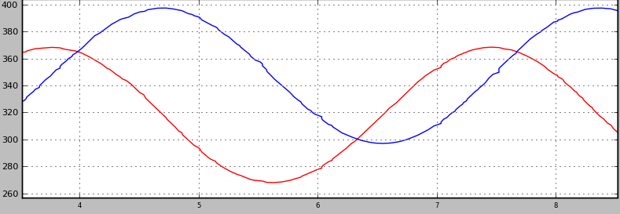{fig-align="center" height="200"}

## Debugging tools: `rqt_graph`

`rqt_graph` shows nodes (ellipses) and topics (rectangles). Use it to confirm your node is connected to both the laser and the velocity controller.

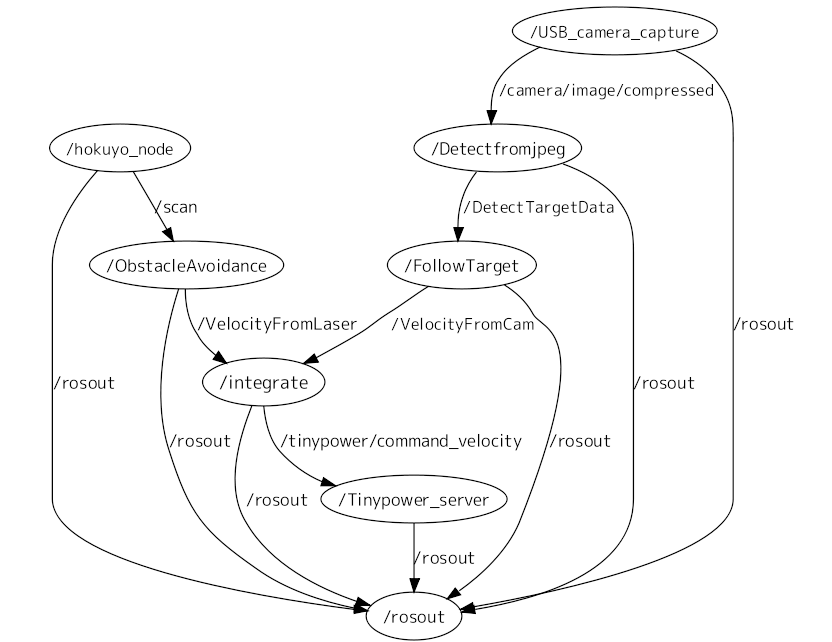{fig-align="center"}

## ROS debugging workflow

- Shutdown one node $\rightarrow$ edit $\rightarrow$ restart : the rest of the system (Gazebo, rviz2) keeps running.
- With `--symlink-install`, Python edits do not even need a rebuild.
- Record a bag of the inputs (`/husky_1/scan`) once; replay it to test your scan-processing code deterministically without the simulator.

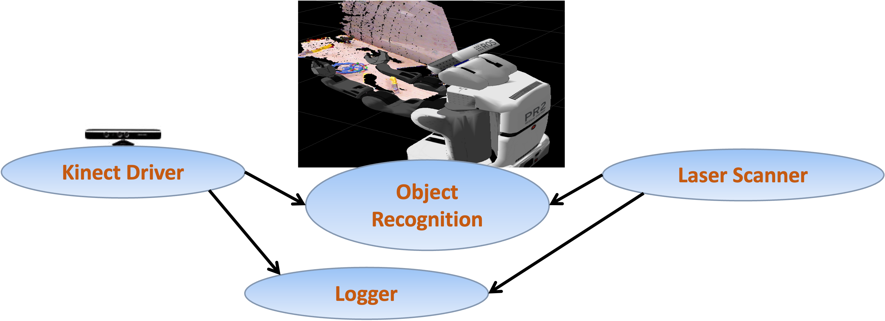{height="230" fig-align="center"}

# Part 9: Visualization and simulation {.center}

## ROS visualization: `rviz2`

::: {.columns}
::: {.column}
Visualize:

-   Sensor data (`LaserScan` as colored points)
-   Robot model and joint states
-   Coordinate frames (`tf2`)
-   Maps being built
-   Debugging 3D markers (`visualization_msgs/Marker`)

```bash
rviz2 -d csc477.rviz
```

Set *Fixed Frame* to `odom` or `base_link`; add a *LaserScan* display and set its topic and QoS to *Best Effort*.
:::

::: {.column}
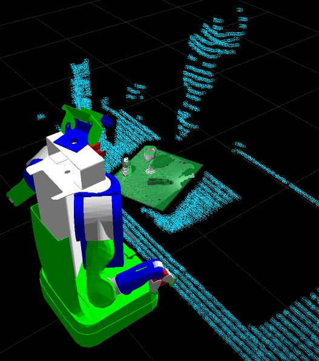
:::
::: 

## ROS transformations: `tf2`

::: {.columns}
::: {.column width="60%"}
- `tf2` maintains a tree of coordinate frames over time (`odom` → `base_link` → `laser`).

- Query it from the command line:

```bash
ros2 run tf2_ros tf2_echo base_link laser
ros2 run tf2_tools view_frames      # writes frames.pdf
```

- From Python: `tf2_ros.Buffer` + `TransformListener`, then `buffer.lookup_transform("base_link", "laser", Time())`.
- For A1 you can assume the lidar frame is aligned with the body frame; check once with `tf2_echo`.
:::

::: {.column width="40%"}

:::
:::

## Simulation: Gazebo

{.absolute right=50 top="50" height="150"}

<br> 

- Modern Gazebo (`gz sim`, formerly "Ignition"): Harmonic pairs with Jazzy, Jetty with Lyrical. The old "Gazebo Classic" reached end of life with ROS 1.
- Gazebo is a separate process; `ros_gz_bridge` translates between Gazebo transport and ROS 2 topics (`/husky_1/scan`, `/husky_1/cmd_vel`, `/clock`).
- Can simulate different robots, sensors, and environments.
- Develop and test in the simulator; if the model is good enough, the same code will work on the real robot with similar performance.

```bash
ros2 launch wall_following_assignment gazebo_world.launch.py world_name:=walls_one_sided
```

## Packages you will meet later

::: {.columns}
::: {.column}
-   Perception
    -   Point Cloud Library (PCL)
    -   OpenCV (`cv_bridge`)
    -   Depth cameras (RealSense, OAK)
-   Navigation: Nav2, SLAM Toolbox
-   Manipulation: MoveIt 2
-   Control: `ros2_control`
:::

::: {.column}
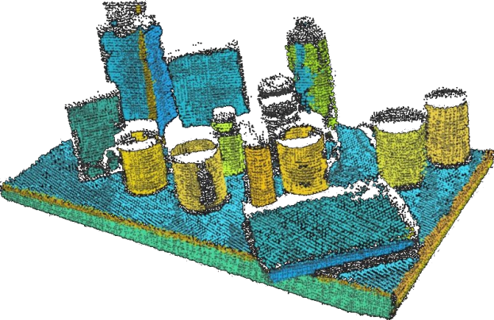{height="150"}

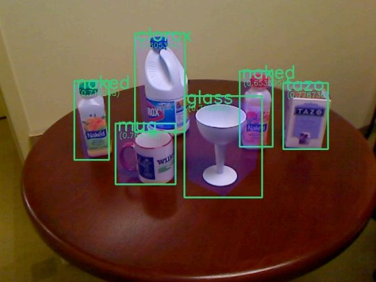{height="150"}

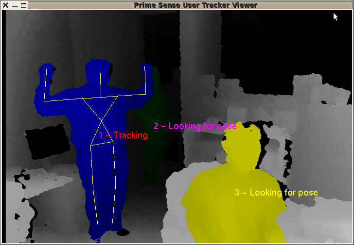{height="200"}
:::
::: 

# Part 10: Exercises {.center}

## Exercises: `tutorials/w02/code`

[GitHub](https://github.com/csc477/2026F_website/tree/main/tutorials/w02/code) **ROS 2 needed** (`colcon build` the package `ros2_ws_src/csc477_tut02`):

3. `minimal_publisher` / `minimal_subscriber`: run them, then inspect with `ros2 topic`, `ros2 node`, `rqt_graph`.
4. `fake_laser_publisher` + `obstacle_monitor`: complete the monitor so it publishes `/front_clearance` (`Float32`) and `/obstacle_ahead` (`Bool`); move the simulated obstacle with `ros2 param set` and watch the topics follow.
5. `param_demo`: change `gain` at runtime from the CLI and from `rqt_reconfigure`.
6. `ros2 launch csc477_tut02 tut02.launch.py`, then `ros2 bag record /front_clearance` and export to CSV.

## Common pitfalls

- Forgot to `source install/setup.bash` after building → `Package 'x' not found`.
- Subscriber receives nothing → QoS mismatch (`ros2 topic info -v`), or wrong topic name (`ros2 topic list`), or you never called `rclpy.spin`.
- `AssertionError: The 'data' field must be of type 'float'` → cast `numpy` scalars with `float()`.
- Robot does not move → the velocity topic name is wrong, or `linear.x` is 0, or the simulation is paused.
- Everything oscillates wildly → `kp` too large, or `dt` is wrong (check with `ros2 topic hz`), or the sign of `angular.z` is flipped.
- Parameters silently ignored → set an `int` where a `float` was declared, or set them before the node declared them.

## ROS resources

{.absolute right=50 top=70 width="150"}

* ROS 2 documentation and tutorials: <https://docs.ros.org/en/jazzy/>
* Beginner tutorials (CLI tools, then client libraries): <https://docs.ros.org/en/jazzy/Tutorials.html>
* `rclpy` API: <https://docs.ros.org/en/jazzy/p/rclpy/>
* Message definitions: <https://docs.ros.org/en/jazzy/p/sensor_msgs/>
* REP 103 (units and coordinate conventions): <https://www.ros.org/reps/rep-0103.html>
* Gazebo: <https://gazebosim.org/docs>
* Q&A: <https://robotics.stackexchange.com/> (tag `ros2`)
